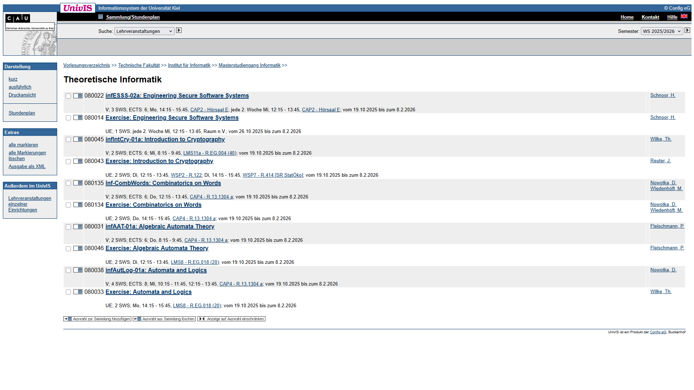
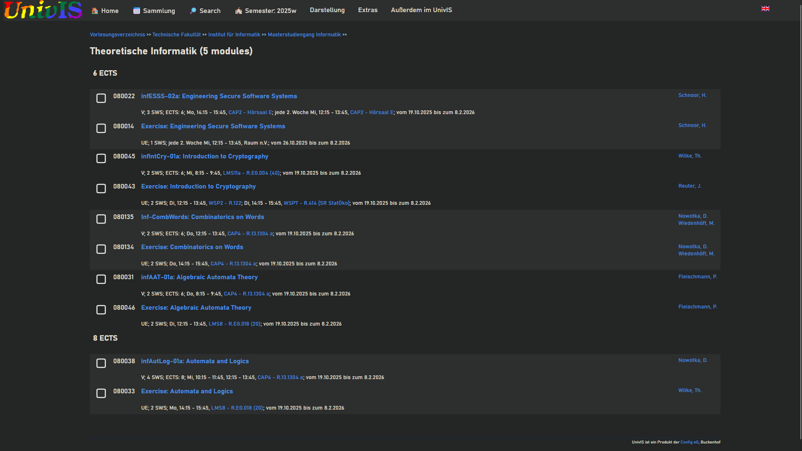

# Better-UnivIS

Ein Userscript, welches das UnivIS der CAU Kiel ein bisschen verbessert. Inspiriert von [better-moodle](https://better-moodle.dev).
Mit Vorsicht genießen. Es können Bugs auftreten und das Skript wurde nur für die Seiten der Informatik und Mathematik getestet. Falls ein Bug gefunden wurde, gerne ein Issue aufmachen.

## Installation

1. Installiert im Browser eurer Wahl einen Userscript-Manager wie [Violentmonkey](https://violentmonkey.github.io/)
2. Im [aktuellen release](https://github.com/realHappyH/Better-UnivIS/releases) die Datei `better-univis.user.js` aufrufen. Bei Violentmonkey sollte dann das Skript installiert werden.
3. UnivIS neu laden

## Aktualisieren

Man kann das Skript jederzeit aktualisieren, wenn man den o.g. Link erneut aufruft.

## Impressionen

Vorher:

Nachher:

